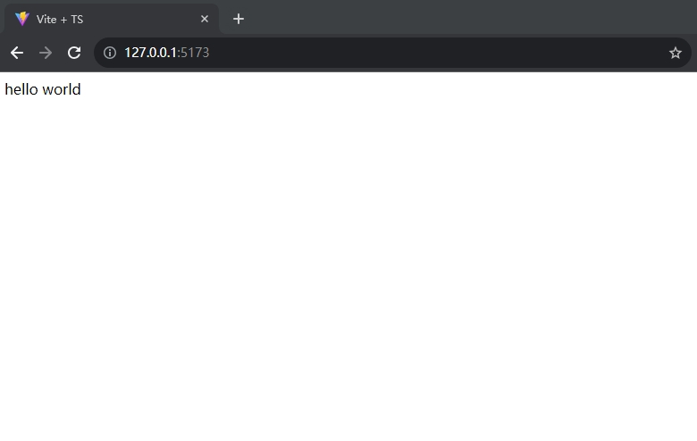

# @idealjs/reactive 是什么？

@idealjs/reactive 是一个简易的 jsx-runtime

它内置了缓存，用于解决性能问题。并且规避了 react 中的树状更新问题。

## 快速开始

1. 使用 vite 快速创建 vanilla-ts 项目

```
yarn create vite my-reactive-app --template vanilla-ts
```

2. 安装依赖

```
yarn add @idealjs/reactive
```

3. 更新 tsconfig.json

```json
{
  "compilerOptions": {
    "target": "ES2020",
    "useDefineForClassFields": true,
    "module": "ESNext",
    "lib": ["ES2020", "DOM", "DOM.Iterable"],
    "skipLibCheck": true,

    /* Bundler mode */
    "moduleResolution": "bundler",
    "allowImportingTsExtensions": true,
    "resolveJsonModule": true,
    "isolatedModules": true,
    "noEmit": true,

    /* Linting */
    "strict": true,
    "noUnusedLocals": true,
    "noUnusedParameters": true,
    "noFallthroughCasesInSwitch": true,

    /* 添加下面两行 */
    "jsx": "react-jsx",
    "jsxImportSource": "@idealjs/reactive"
  },
  "include": ["src"]
}
```

4. 修改 index.html

```html
<!doctype html>
<html lang="en">
  <head>
    <meta charset="UTF-8" />
    <link rel="icon" type="image/svg+xml" href="/vite.svg" />
    <meta name="viewport" content="width=device-width, initial-scale=1.0" />
    <title>Vite + TS</title>
  </head>
  <body>
    <div id="app"></div>
    <!-- 修改下行 src="/src/main.tsx" -->
    <script type="module" src="/src/main.tsx"></script>
  </body>
</html>
```

5. 新建 src/main.tsx

```tsx
import { upsert } from "@idealjs/reactive";

const root = document.getElementById("app")!;

upsert(root, <div>hello world</div>);
```

6. 启动项目


