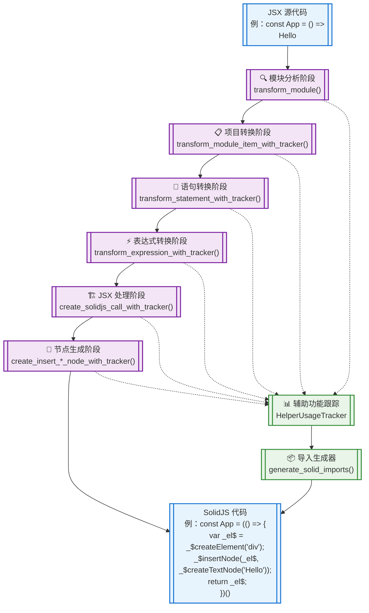

# JSX 模板转换系统架构图

## 系统概览

这是一个将 JSX 语法转换为 SolidJS 兼容代码的转换系统。系统采用分层架构设计，从模块级别逐步深入到节点级别进行转换。

## 核心架构流程图



## 详细调用关系图

```mermaid
graph TD
    %% 入口函数
    transform_module["🚀 transform_module<br/>(transform_module.rs:8)"]
    
    %% 第二层：模块处理
    transform_module_item_with_tracker["📦 transform_module_item_with_tracker<br/>(transform_module_item.rs:6)"]
    generate_solid_imports["📥 generate_solid_imports<br/>(generate_solid_imports.rs:8)"]
    
    %% 第三层：语句处理
    transform_statement_with_tracker["📝 transform_statement_with_tracker<br/>(transform_statement.rs:9)"]
    transform_export["📤 transform_export<br/>(transform_export.rs:3)"]
    
    %% 第四层：表达式处理
    transform_expression_with_tracker["🔄 transform_expression_with_tracker<br/>(transform_expression.rs:8)"]
    transform_arrow_function["🏹 transform_arrow_function<br/>(transform_arrow_function.rs:5)"]
    
    %% JSX检测链
    contains_jsx["🔍 contains_jsx<br/>(contains_jsx.rs:6)"]
    contains_jsx_in_statement["🔍 contains_jsx_in_statement<br/>(contains_jsx_in_statement.rs:4)"]
    contains_jsx_in_expression["🔍 contains_jsx_in_expression<br/>(contains_jsx_in_expression.rs:3)"]
    
    %% JSX收集链
    collect_jsx_elements["📋 collect_jsx_elements<br/>(collect_jsx_elements.rs:6)"]
    collect_jsx_from_statement["📋 collect_jsx_from_statement<br/>(collect_jsx_from_statement.rs:5)"]
    collect_jsx_from_expression["📋 collect_jsx_from_expression<br/>(collect_jsx_from_expression.rs:4)"]
    
    %% JSX创建层
    create_solidjs_call_with_tracker["🏭 create_solidjs_call_with_tracker<br/>(create_solidjs_call.rs:13)"]
    create_solidjs_call_with_tracker_self_closing["🏭 create_solidjs_call_with_tracker_self_closing<br/>(create_solidjs_call_self_closing.rs:7)"]
    
    %% 节点创建层
    create_insert_text_node_with_tracker["📄 create_insert_text_node_with_tracker<br/>(create_insert_text_node.rs:5)"]
    create_insert_expression_node_with_tracker["🔗 create_insert_expression_node_with_tracker<br/>(create_insert_expression_node.rs:5)"]
    
    %% 属性处理层
    handle_jsx_attributes["⚙️ handle_jsx_attributes<br/>(handle_jsx_attributes.rs:5)"]
    handle_jsx_self_closing_attributes["⚙️ handle_jsx_self_closing_attributes<br/>(handle_jsx_self_closing_attributes.rs:5)"]
    
    %% 工具函数
    is_custom_component["🎯 is_custom_component<br/>(create_solidjs_call.rs:9)"]
    
    %% === 主要调用关系 ===
    
    %% transform_module 的直接调用
    transform_module --> transform_module_item_with_tracker
    transform_module --> generate_solid_imports
    
    %% transform_module_item_with_tracker 的调用
    transform_module_item_with_tracker --> transform_statement_with_tracker
    transform_module_item_with_tracker --> transform_export
    
    %% transform_statement_with_tracker 的调用
    transform_statement_with_tracker --> transform_expression_with_tracker
    transform_statement_with_tracker --> contains_jsx_in_expression
    transform_statement_with_tracker --> transform_arrow_function
    
    %% transform_expression_with_tracker 的调用
    transform_expression_with_tracker --> create_solidjs_call_with_tracker
    transform_expression_with_tracker --> create_solidjs_call_with_tracker_self_closing
    transform_expression_with_tracker --> transform_arrow_function
    
    %% 关键递归调用
    transform_arrow_function --> transform_expression_with_tracker
    create_solidjs_call_with_tracker --> create_solidjs_call_with_tracker
    create_solidjs_call_with_tracker --> transform_expression_with_tracker
    
    %% create_solidjs_call_with_tracker 的其他调用
    create_solidjs_call_with_tracker --> handle_jsx_attributes
    create_solidjs_call_with_tracker --> create_insert_text_node_with_tracker
    create_solidjs_call_with_tracker --> create_insert_expression_node_with_tracker
    create_solidjs_call_with_tracker --> is_custom_component
    
    %% create_solidjs_call_with_tracker_self_closing 的调用
    create_solidjs_call_with_tracker_self_closing --> handle_jsx_self_closing_attributes
    
    %% JSX检测链的调用关系
    contains_jsx --> contains_jsx_in_statement
    contains_jsx --> contains_jsx_in_expression
    contains_jsx_in_statement --> contains_jsx_in_expression
    
    %% JSX收集链的调用关系
    collect_jsx_elements --> collect_jsx_from_statement
    collect_jsx_from_statement --> collect_jsx_from_expression
    collect_jsx_from_expression --> collect_jsx_from_expression
```



## 函数分类总览

### 🌟 核心转换流程 (5个函数)
- `transform_module()` - 模块级入口
- `transform_module_item_with_tracker()` - 模块项转换
- `transform_statement_with_tracker()` - 语句转换  
- `transform_expression_with_tracker()` - 表达式转换
- `transform_arrow_function()` - 箭头函数转换

### ⚡ JSX 处理引擎 (3个函数)
- `create_solidjs_call_with_tracker()` - JSX 元素转换
- `create_solidjs_call_with_tracker_self_closing()` - 自闭合标签转换
- `is_custom_component()` - 组件类型判断

### 🧩 节点生成器 (4个函数)
- `create_insert_text_node_with_tracker()` - 文本节点生成
- `create_insert_expression_node_with_tracker()` - 表达式节点生成
- `handle_jsx_attributes()` - 属性处理
- `handle_jsx_self_closing_attributes()` - 自闭合属性处理

### 🔍 JSX 检测器 (3个函数)
- `contains_jsx()` - 模块级 JSX 检测
- `contains_jsx_in_statement()` - 语句级 JSX 检测
- `contains_jsx_in_expression()` - 表达式级 JSX 检测

### 📊 JSX 收集器 (3个函数)
- `collect_jsx_elements()` - 模块级 JSX 收集
- `collect_jsx_from_statement()` - 语句级 JSX 收集
- `collect_jsx_from_expression()` - 表达式级 JSX 收集

### 🛠️ 辅助工具 (2个函数)
- `generate_solid_imports()` - 导入语句生成
- `transform_export()` - 导出语句转换

## 关键数据流

### 1. 主转换流水线
```
JSX 源代码 
  → 模块解析 
  → 语句遍历 
  → 表达式识别 
  → JSX 转换 
  → 节点生成 
  → SolidJS 代码
```

### 2. 辅助功能跟踪
```
转换过程 
  → 记录使用的辅助函数 
  → 生成对应导入语句 
  → 插入到模块顶部
```

### 3. 递归处理机制
```
嵌套 JSX 
  → 递归调用转换函数 
  → 处理子元素 
  → 组装最终结果
```

## 性能特征

- **时间复杂度**: O(n)，其中 n 是 AST 节点数量
- **空间复杂度**: O(d)，其中 d 是 JSX 嵌套深度
- **并发安全**: 无状态函数设计，支持并发处理
- **内存效率**: 采用流式处理，避免大量中间对象

## 扩展点

1. **自定义转换规则**: 通过修改 `transform_expression_with_tracker()` 添加新的表达式类型支持
2. **属性处理扩展**: 通过 `handle_jsx_attributes()` 添加特殊属性处理逻辑
3. **目标框架适配**: 通过 `create_solidjs_call_with_tracker()` 适配不同的目标框架
4. **优化策略**: 通过 `HelperUsageTracker` 添加更多优化指标跟踪

---

*此架构图展示了 JSX 模板转换系统的整体设计和核心流程，有助于理解系统的工作原理和扩展方向。*