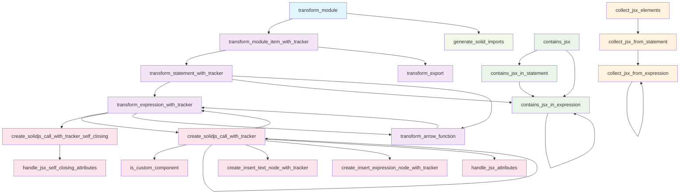

# JSX 模板转换系统函数调用关系文档

## 概述

本文档详细记录了 `packages/sapling_transformation/src/transformations/jsx_template/` 目录下所有函数的调用关系和架构设计。该系统负责将 JSX 语法转换为 SolidJS 兼容的代码。

## 系统架构

### 模块分层

```
┌─────────────────────────────────────────────────────────────┐
│                    模块级入口                                │
│                 transform_module()                          │
└─────────────────────────┬───────────────────────────────────┘
                         │
┌─────────────────────────▼───────────────────────────────────┐
│                    转换协调层                                │
│    transform_module_item_with_tracker()                     │
│    transform_statement_with_tracker()                       │
│    transform_expression_with_tracker()                      │
└─────────────────────────┬───────────────────────────────────┘
                         │
┌─────────────────────────▼───────────────────────────────────┐
│                    JSX 处理层                               │
│    create_solidjs_call_with_tracker()                       │
│    create_solidjs_call_with_tracker_self_closing()          │
│    transform_arrow_function()                              │
└─────────────────────────┬───────────────────────────────────┘
                         │
┌─────────────────────────▼───────────────────────────────────┐
│                    节点创建层                                │
│    create_insert_text_node_with_tracker()                  │
│    create_insert_expression_node_with_tracker()            │
│    handle_jsx_attributes()                                 │
│    handle_jsx_self_closing_attributes()                    │
└─────────────────────────────────────────────────────────────┘
```

## 函数详细规格

### 1. 模块级入口函数

#### `transform_module()`
**文件**: [`transform_module.rs`](packages/sapling_transformation/src/transformations/jsx_template/transform_module.rs)

**签名**: 
```rust
pub fn transform_module(module: &JsModule, _state: &TransformState) -> Option<JsModule>
```

**功能**: 转换整个 JavaScript 模块，处理所有包含 JSX 的模块项

**调用关系**:
- 调用 `transform_module_item_with_tracker()` 处理每个模块项
- 调用 `generate_solid_imports()` 生成必要的导入语句

**处理流程**:
1. 初始化 `HelperUsageTracker` 跟踪使用的辅助函数
2. 遍历并转换所有模块项
3. 根据使用情况生成 SolidJS 导入语句
4. 重构模块 AST

---

### 2. 转换协调层函数

#### `transform_module_item_with_tracker()`
**文件**: [`transform_module_item.rs`](packages/sapling_transformation/src/transformations/jsx_template/transform_module_item.rs)

**签名**: 
```rust
pub fn transform_module_item_with_tracker(item: &AnyJsModuleItem, tracker: &mut HelperUsageTracker) -> AnyJsModuleItem
```

**功能**: 转换单个模块项（语句或导出）

**调用关系**:
- 调用 `transform_statement_with_tracker()` 处理语句
- 调用 `transform_export()` 处理导出

#### `transform_statement_with_tracker()`
**文件**: [`transform_statement.rs`](packages/sapling_transformation/src/transformations/jsx_template/transform_statement.rs)

**签名**: 
```rust
pub fn transform_statement_with_tracker(stmt: &AnyJsStatement, tracker: &mut HelperUsageTracker) -> AnyJsStatement
```

**功能**: 转换各种类型的 JavaScript 语句

**调用关系**:
- 调用 `transform_expression_with_tracker()` 处理表达式
- 调用 `contains_jsx_in_expression()` 检查是否包含 JSX
- 调用 `transform_arrow_function()` 处理箭头函数

**处理的语句类型**:
- `JsExpressionStatement`: 表达式语句
- `JsReturnStatement`: 返回语句
- `JsFunctionDeclaration`: 函数声明
- `JsVariableStatement`: 变量声明

#### `transform_expression_with_tracker()`
**文件**: [`transform_expression.rs`](packages/sapling_transformation/src/transformations/jsx_template/transform_expression.rs)

**签名**: 
```rust
pub fn transform_expression_with_tracker(expr: &AnyJsExpression, tracker: &mut HelperUsageTracker) -> Option<AnyJsExpression>
```

**功能**: 转换包含 JSX 的表达式

**调用关系**:
- 调用 `create_solidjs_call_with_tracker()` 处理 JSX 元素
- 调用 `create_solidjs_call_with_tracker_self_closing()` 处理自闭合元素
- 调用 `transform_arrow_function()` 处理箭头函数

**处理的表达式类型**:
- `JsxTagExpression`: JSX 标签表达式
- `JsParenthesizedExpression`: 括号表达式
- `JsArrowFunctionExpression`: 箭头函数表达式

---

### 3. JSX 处理层函数

#### `create_solidjs_call_with_tracker()`
**文件**: [`create_solidjs_call.rs`](packages/sapling_transformation/src/transformations/jsx_template/create_solidjs_call.rs)

**签名**: 
```rust
pub fn create_solidjs_call_with_tracker(jsx_element: &JsxElement, tracker: &mut HelperUsageTracker) -> Option<AnyJsExpression>
```

**功能**: 将 JSX 元素转换为 SolidJS 调用的立即执行函数表达式 (IIFE)

**调用关系**:
- 调用 `is_custom_component()` 判断组件类型
- 递归调用自己处理嵌套 JSX 元素
- 调用 `transform_expression_with_tracker()` 处理表达式子元素
- 调用 `create_insert_text_node_with_tracker()` 创建文本节点
- 调用 `create_insert_expression_node_with_tracker()` 创建表达式节点
- 调用 `handle_jsx_attributes()` 处理属性

**转换逻辑**:
1. 检查是否为自定义组件，如果是则保持 JSX 格式
2. 对于原生标签，创建 `var _el$ = _$createElement("tagName")` 语句
3. 处理属性设置
4. 递归处理子元素
5. 返回 `_el$`
6. 包装为 IIFE

#### `create_solidjs_call_with_tracker_self_closing()`
**文件**: [`create_solidjs_call_self_closing.rs`](packages/sapling_transformation/src/transformations/jsx_template/create_solidjs_call_self_closing.rs)

**签名**: 
```rust
pub fn create_solidjs_call_with_tracker_self_closing(jsx_element: &JsxSelfClosingElement, tracker: &mut HelperUsageTracker) -> Option<AnyJsExpression>
```

**功能**: 处理自闭合 JSX 标签（如 `<input />`, `<br />`）

**调用关系**:
- 调用 `handle_jsx_self_closing_attributes()` 处理属性

#### `transform_arrow_function()`
**文件**: [`transform_arrow_function.rs`](packages/sapling_transformation/src/transformations/jsx_template/transform_arrow_function.rs)

**签名**: 
```rust
pub fn transform_arrow_function(arrow_fn: &JsArrowFunctionExpression) -> Option<AnyJsExpression>
```

**功能**: 转换箭头函数中的 JSX 表达式

**调用关系**:
- 调用 `transform_expression_with_tracker()` 处理函数体表达式

**处理逻辑**:
- 处理表达式形式的函数体 `() => <div />`
- 处理语句块形式的函数体 `() => { return <div />; }`

---

### 4. 节点创建层函数

#### `create_insert_text_node_with_tracker()`
**文件**: [`create_insert_text_node.rs`](packages/sapling_transformation/src/transformations/jsx_template/create_insert_text_node.rs)

**签名**: 
```rust
pub fn create_insert_text_node_with_tracker(text: &str, tracker: &mut HelperUsageTracker) -> Option<AnyJsStatement>
```

**功能**: 创建文本节点插入语句

**生成代码**: 
```javascript
_$insertNode(_el$, _$createTextNode("text"));
```

#### `create_insert_expression_node_with_tracker()`
**文件**: [`create_insert_expression_node.rs`](packages/sapling_transformation/src/transformations/jsx_template/create_insert_expression_node.rs)

**签名**: 
```rust
pub fn create_insert_expression_node_with_tracker(expr_child: &JsxExpressionChild, tracker: &mut HelperUsageTracker) -> Option<AnyJsStatement>
```

**功能**: 创建表达式节点插入语句

**生成代码**: 
```javascript
_$insertNode(_el$, _$createTextNode(expression));
```

#### `handle_jsx_attributes()`
**文件**: [`handle_jsx_attributes.rs`](packages/sapling_transformation/src/transformations/jsx_template/handle_jsx_attributes.rs)

**签名**: 
```rust
pub fn handle_jsx_attributes(opening_element: JsxOpeningElement) -> Option<Vec<AnyJsStatement>>
```

**功能**: 处理 JSX 元素的属性，生成 setAttribute 调用

**处理的属性类型**:
- 静态属性: `<div className="test" />`
- 动态属性: `<div className={variable} />`
- 布尔属性: `<input disabled />`
- 展开属性: `<div {...props} />`

#### `handle_jsx_self_closing_attributes()`
**文件**: [`handle_jsx_self_closing_attributes.rs`](packages/sapling_transformation/src/transformations/jsx_template/handle_jsx_self_closing_attributes.rs)

**签名**: 
```rust
pub fn handle_jsx_self_closing_attributes(jsx_element: &JsxSelfClosingElement) -> Option<Vec<AnyJsStatement>>
```

**功能**: 处理自闭合标签的属性

---

### 5. 辅助功能函数

#### `generate_solid_imports()`
**文件**: [`generate_solid_imports.rs`](packages/sapling_transformation/src/transformations/jsx_template/generate_solid_imports.rs)

**签名**: 
```rust
pub fn generate_solid_imports(need_create_text_node: bool, need_insert_node: bool, need_create_element: bool) -> Vec<biome_js_syntax::JsImport>
```

**功能**: 根据使用情况生成 SolidJS 导入语句

**生成的导入**:
```javascript
import { createTextNode as _$createTextNode } from "solid-universal-module";
import { insertNode as _$insertNode } from "solid-universal-module";
import { createElement as _$createElement } from "solid-universal-module";
```

#### `is_custom_component()`
**文件**: [`create_solidjs_call.rs`](packages/sapling_transformation/src/transformations/jsx_template/create_solidjs_call.rs)

**签名**: 
```rust
fn is_custom_component(tag_name: &str) -> bool
```

**功能**: 判断是否为自定义组件（首字母大写）

#### `transform_export()`
**文件**: [`transform_export.rs`](packages/sapling_transformation/src/transformations/jsx_template/transform_export.rs)

**签名**: 
```rust
pub fn transform_export(export: &JsExport) -> JsExport
```

**功能**: 转换导出语句（当前为简化实现）

---

### 6. JSX 检测函数

#### `contains_jsx()`
**文件**: [`contains_jsx.rs`](packages/sapling_transformation/src/transformations/jsx_template/contains_jsx.rs)

**签名**: 
```rust
pub fn contains_jsx(item: &AnyJsModuleItem) -> bool
```

**功能**: 检查模块项是否包含 JSX 元素

**调用关系**:
- 调用 `contains_jsx_in_statement()` 检查语句
- 调用 `contains_jsx_in_expression()` 检查表达式

#### `contains_jsx_in_statement()`
**文件**: [`contains_jsx_in_statement.rs`](packages/sapling_transformation/src/transformations/jsx_template/contains_jsx_in_statement.rs)

**签名**: 
```rust
pub fn contains_jsx_in_statement(stmt: &AnyJsStatement) -> bool
```

**功能**: 检查语句是否包含 JSX

**调用关系**:
- 调用 `contains_jsx_in_expression()` 检查表达式

#### `contains_jsx_in_expression()`
**文件**: [`contains_jsx_in_expression.rs`](packages/sapling_transformation/src/transformations/jsx_template/contains_jsx_in_expression.rs)

**签名**: 
```rust
pub fn contains_jsx_in_expression(expr: &AnyJsExpression) -> bool
```

**功能**: 检查表达式是否包含 JSX

**递归检查**:
- `JsxTagExpression`: 直接返回 true
- `JsArrowFunctionExpression`: 递归检查函数体
- `JsParenthesizedExpression`: 递归检查内部表达式

---

### 7. JSX 收集函数

#### `collect_jsx_elements()`
**文件**: [`collect_jsx_elements.rs`](packages/sapling_transformation/src/transformations/jsx_template/collect_jsx_elements.rs)

**签名**: 
```rust
pub fn collect_jsx_elements(item: &AnyJsModuleItem, jsx_elements: &mut Vec<JsxElementInfo>)
```

**功能**: 从模块项中收集 JSX 元素信息

**调用关系**:
- 调用 `collect_jsx_from_statement()` 收集语句中的 JSX

#### `collect_jsx_from_statement()`
**文件**: [`collect_jsx_from_statement.rs`](packages/sapling_transformation/src/transformations/jsx_template/collect_jsx_from_statement.rs)

**签名**: 
```rust
pub fn collect_jsx_from_statement(stmt: &AnyJsStatement, jsx_elements: &mut Vec<JsxElementInfo>, in_function: bool)
```

**功能**: 从语句中收集 JSX 元素

**调用关系**:
- 调用 `collect_jsx_from_expression()` 收集表达式中的 JSX

#### `collect_jsx_from_expression()`
**文件**: [`collect_jsx_from_expression.rs`](packages/sapling_transformation/src/transformations/jsx_template/collect_jsx_from_expression.rs)

**签名**: 
```rust
pub fn collect_jsx_from_expression(expr: &AnyJsExpression, jsx_elements: &mut Vec<JsxElementInfo>, in_function: bool)
```

**功能**: 从表达式中收集 JSX 元素信息

**递归收集**:
- `JsxTagExpression`: 提取标签信息
- `JsArrowFunctionExpression`: 递归收集函数体
- `JsParenthesizedExpression`: 递归收集内部表达式

## 调用关系图



## 关键设计模式

### 1. 访问者模式 (Visitor Pattern)
整个转换系统采用访问者模式，通过不同的 transform 函数遍历 AST 的各个节点。

### 2. 策略模式 (Strategy Pattern)
针对不同类型的 JSX 元素（普通元素、自闭合元素、Fragment 等）使用不同的处理策略。

### 3. 递归下降 (Recursive Descent)
转换过程采用递归下降的方式，从模块级别逐步深入到表达式级别。

### 4. 状态跟踪 (State Tracking)
使用 `HelperUsageTracker` 跟踪转换过程中使用的辅助函数，以便生成对应的导入语句。

## 性能考量

### 1. 递归深度控制
- 限制 JSX 嵌套深度，防止栈溢出
- 使用迭代方式处理深层嵌套

### 2. 内存管理
- 及时释放不再使用的 AST 节点
- 复用临时对象减少内存分配

### 3. 缓存机制
- 缓存组件类型判断结果
- 缓存重复的属性处理逻辑

## 扩展性设计

### 1. 插件化架构
- 属性处理器可以插件化扩展
- 支持自定义转换规则

### 2. 配置化选项
- 支持不同的目标框架（React、Vue、SolidJS）
- 可配置的优化选项

### 3. 错误处理
- 完善的错误报告机制
- 支持部分转换失败的情况

## 未来改进方向

1. **性能优化**: 减少不必要的递归调用
2. **错误处理**: 增强错误报告和恢复机制
3. **测试覆盖**: 增加边界情况和异常情况的测试
4. **文档完善**: 增加更多使用示例和最佳实践
5. **工具支持**: 提供调试和分析工具

---

*本文档基于代码分析自动生成，如有问题请参考源代码实现。*