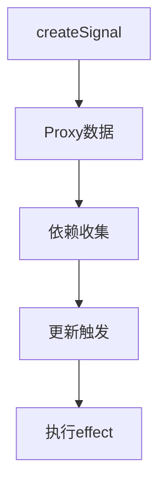
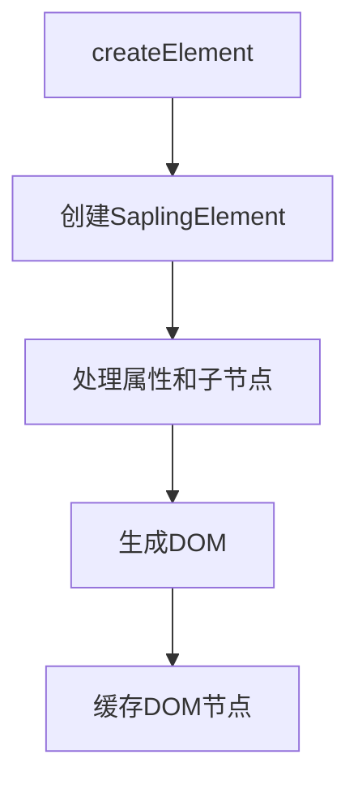

# System Patterns

## 核心架构设计

### 1. 代码组织模式
```
sapling/
├── packages/
│   ├── core/          # 核心运行时
│   ├── reactive/      # 响应式系统
│   ├── sapling_transformer/  # JSX 转换器
│   └── sapling_shared/      # 共享代码
```

### 2. 响应式系统设计


核心概念:
- Signal: 响应式数据源
- Effect: 副作用函数
- Derive: 派生计算
- Proxy: 数据劫持机制

### 3. 组件渲染流程

1. JSX 转换过程:


2. 渲染过程:


### 4. 缓存策略

组件缓存规则:
- 绿色部分: 静态内容，不需要重新生成
- 红色部分: 响应式变量更新时重新生成
- 橙色部分: 根据缓存状态决定是否重新生成

### 5. 更新机制

更新流程:
1. 响应式数据变更
2. 触发相关 effect
3. 生成新的 SaplingElement
4. 对比并更新 DOM

优化策略:
- 精确的依赖追踪
- DOM 节点复用
- 批量更新处理

## 核心设计原则

1. 性能优先
   - 最小化不必要的更新
   - 充分利用缓存
   - 避免全树遍历

2. 开发体验
   - 简单直观的 API
   - 完善的类型支持
   - 友好的错误提示

3. 可维护性
   - 模块化设计
   - 清晰的职责划分
   - 完善的测试覆盖