# SolidJS Transformer 流程图

## 概述

SolidJS Transformer 是一个基于 Rust 和 Biome 的 JSX 转换器，将 JSX 语法转换为 SolidJS 运行时调用。本文档详细描述了转换器的工作流程和决策路径。

## 整体架构流程

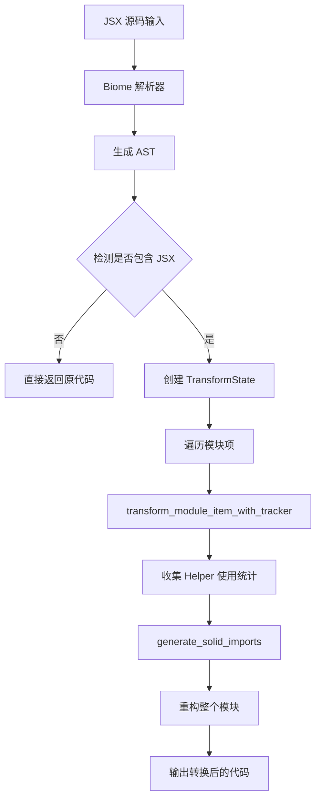

## 核心转换决策流程

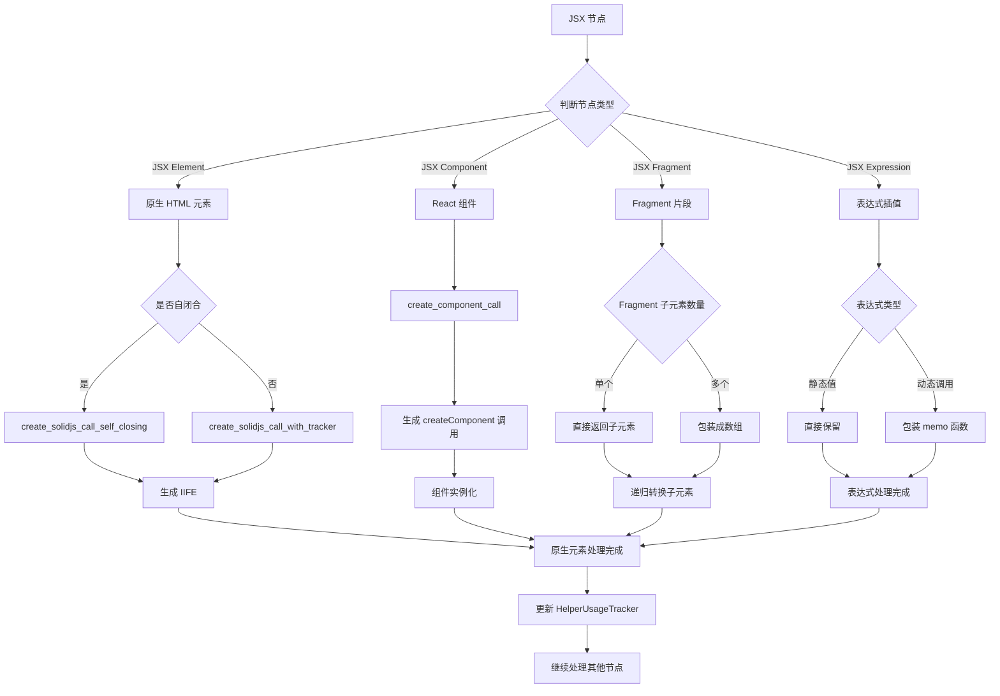

## JSX 元素转换详细流程

### 1. 原生元素转换 (如 `<div>`)

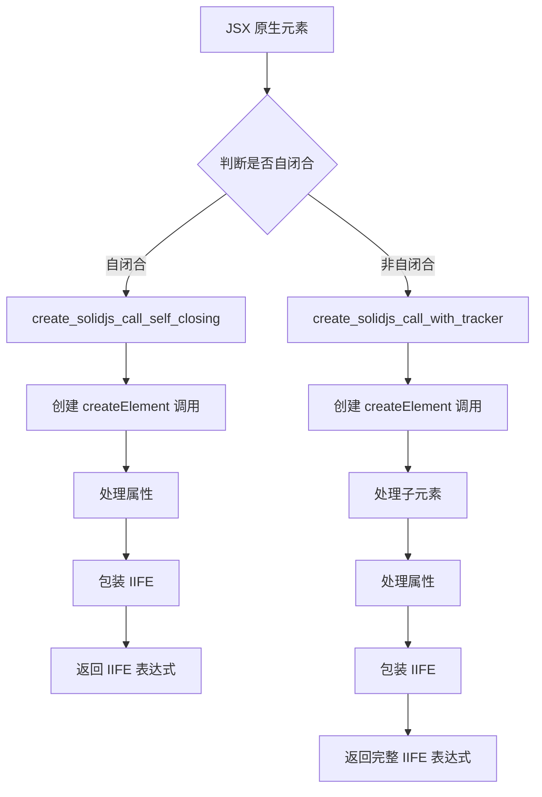

### 2. 组件转换 (如 `<Component>`)

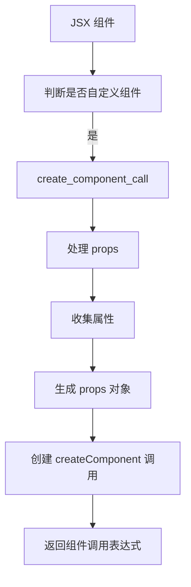

### 3. Fragment 转换 (如 `<>...</>`)

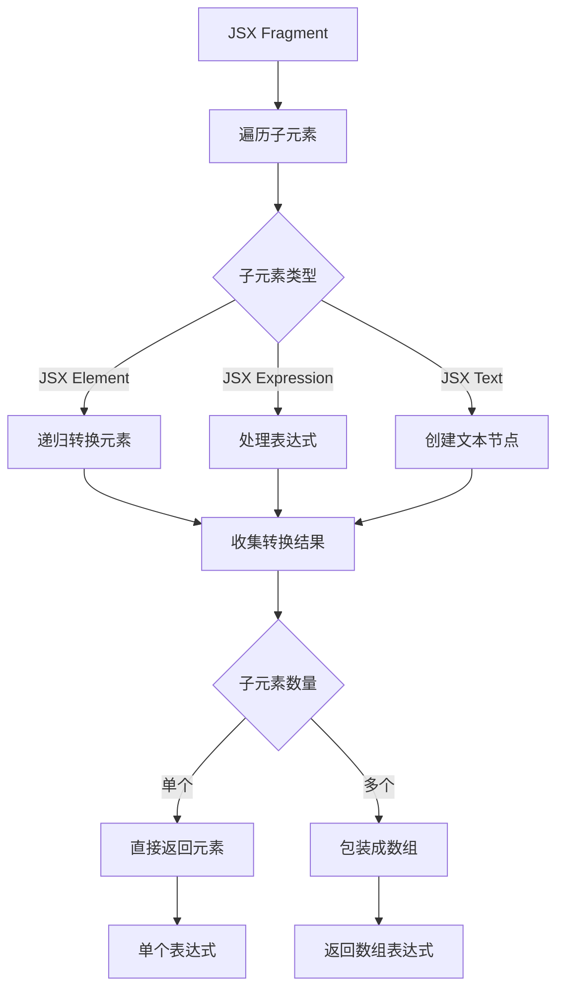

### 4. 表达式转换 (如 `{value}`)

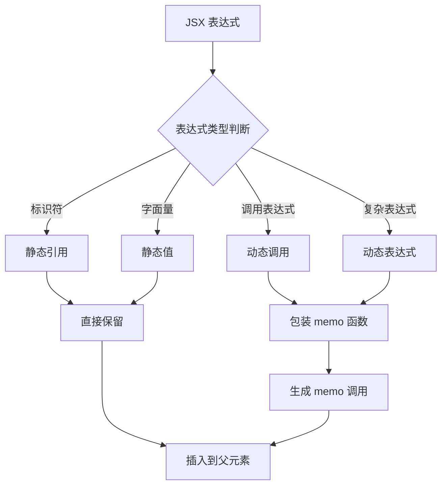

## 属性处理流程

### 静态属性处理

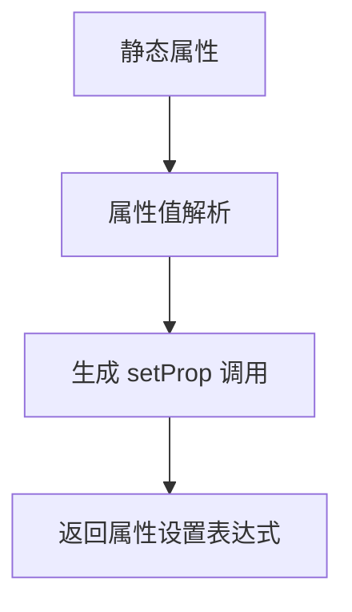

### 动态属性处理

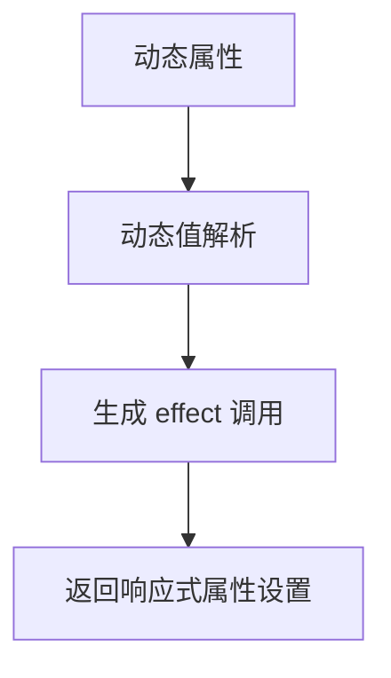

### 事件处理

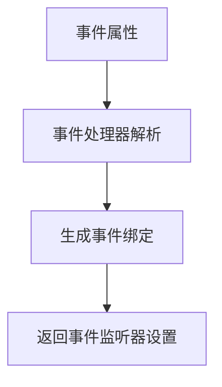

## Helper 函数统计

转换过程中会统计使用的 helper 函数：

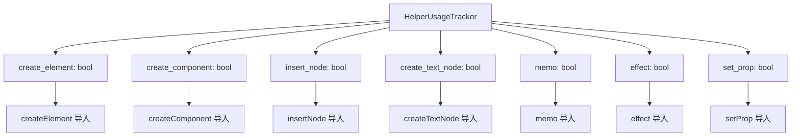

## 转换示例

### 简单元素转换

**输入:**
```jsx
<div>Hello</div>
```

**输出:**
```javascript
(() => {
  var _el$ = _$createElement("div");
  _$insertNode(_el$, _$createTextNode("Hello"));
  return _el$;
})()
```

### Fragment 转换

**输入:**
```jsx
<>
  <div>First</div>
  <div>Second</div>
</>
```

**输出:**
```javascript
[
  (() => {
    var _el$ = _$createElement("div");
    _$insertNode(_el$, _$createTextNode("First"));
    return _el$;
  })(),
  (() => {
    var _el$2 = _$createElement("div");
    _$insertNode(_el$2, _$createTextNode("Second"));
    return _el$2;
  })()
]
```

### 组件转换

**输入:**
```jsx
<Component prop={value} />
```

**输出:**
```javascript
_$createComponent(Component, { prop: value })
```

### 动态表达式转换

**输入:**
```jsx
<div>{count()}</div>
```

**输出:**
```javascript
(() => {
  var _el$ = _$createElement("div");
  _$insertNode(_el$, _$memo(() => count()));
  return _el$;
})()
```

## 当前实现状态

### 已实现功能 ✅
- [x] 基础 JSX 元素转换
- [x] 自闭合元素处理
- [x] Fragment 转换
- [x] 组件调用生成
- [x] 静态属性处理
- [x] Helper 函数统计
- [x] Import 语句生成

### 部分实现功能 ⚠️
- [x] JSX 表达式处理 (基础版本)
- [x] 动态属性处理 (需要完善)
- [x] 事件绑定 (需要实现)
- [x] 文本节点处理 (需要优化)

### 待实现功能 ❌
- [ ] 条件渲染优化
- [ ] 列表渲染优化
- [ ] 复杂表达式处理
- [ ] 错误处理机制
- [ ] 源码映射支持
- [ ] 性能优化

## 技术架构

### 依赖关系

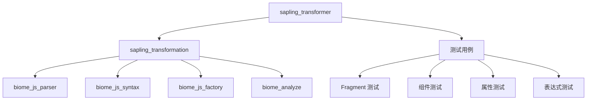

### 模块结构

```
src/transformations/jsx_template/
├── transform_module.rs          # 模块级转换
├── transform_expression.rs      # 表达式转换
├── transform_statement.rs       # 语句转换
├── create_solidjs_call_*.rs     # SolidJS 调用生成
├── create_component_call.rs     # 组件调用生成
├── handle_jsx_attributes.rs     # 属性处理
├── generate_solid_imports.rs    # Import 生成
└── helpers/                     # 辅助函数
```

## 总结

SolidJS Transformer 采用了模块化的设计，通过 Biome 解析器处理 JSX 语法，然后根据不同的 JSX 节点类型选择相应的转换策略。核心思路是将 JSX 转换为 SolidJS 的运行时调用，通过 IIFE 模式确保每个元素都有独立的作用域，同时通过 Helper 函数统计来优化 import 语句的生成。

当前实现已经覆盖了基础的转换功能，但在复杂表达式处理、性能优化和错误处理方面还有改进空间。