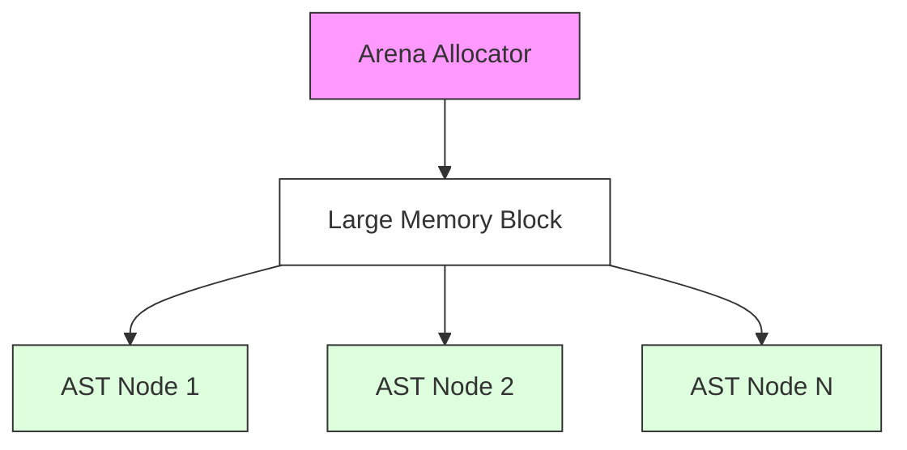
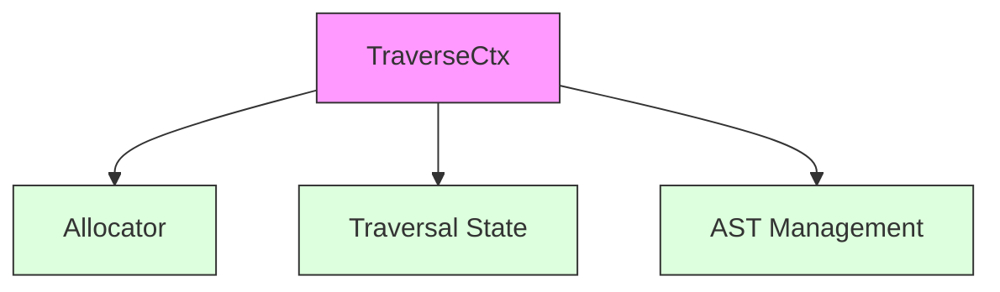

# System Patterns

## Memory Management Architecture

### Arena Allocation Pattern


1. **统一生命周期管理**
   - 所有 AST 节点共享同一个内存块
   - 整体分配和释放，减少内存碎片
   - 适合 AST 这种树形结构数据

2. **分层设计模式**


### 内存操作流程
1. **基础分配流程**
   - Allocator 负责底层内存块管理
   - 通过 `new_in(allocator)` 在 arena 中创建集合
   - 使用 `CloneIn` trait 处理克隆操作

2. **AST 节点管理流程**
   - TraverseCtx 封装高级操作
   - 通过 `ctx.alloc()` 分配 AST 节点
   - 自动管理节点生命周期

## 关键实现模式

### 内存安全保证
1. **通过生命周期标注**
```rust
pub fn append_templates<'a>(
    ctx: &mut TraverseCtx<'a>,
    allocator: &'a Allocator,
    // ...
)
```

2. **通过类型系统**
   - 使用泛型和 trait bounds 确保类型安全
   - 通过 ownership 和 borrowing 规则保证内存安全

### 性能优化模式
1. **批量操作**
   - 使用 arena 分配避免频繁的内存操作
   - 统一管理相关资源的生命周期

2. **上下文复用**
   - TraverseCtx 维护遍历状态
   - 减少重复的内存分配和状态初始化
