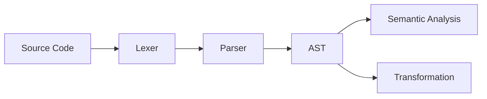
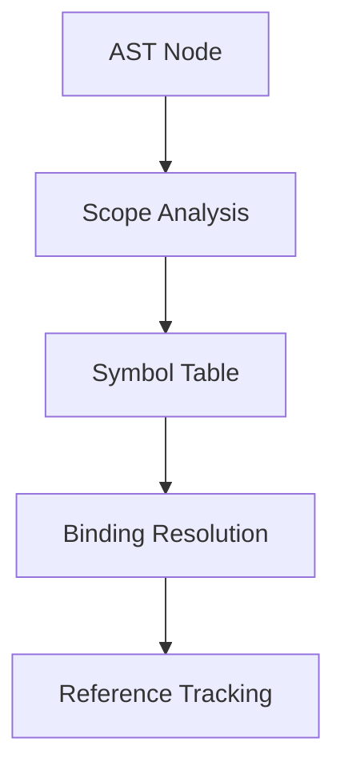

# System Patterns

## Architectural Patterns

1. **Modular Architecture**
   ```
   oxc/
   ├── oxc_parser     # Parser implementation
   ├── oxc_ast        # AST definitions
   ├── oxc_semantic   # Semantic analysis
   ├── oxc_transformer # Code transformation
   ├── oxc_allocator  # Memory management
   └── oxc_span       # Source location tracking
   ```

2. **Memory Management Pattern**
   - Arena-based allocation using `oxc_allocator`
   - Bump allocation for fast allocation/deallocation
   - Lifetime tracking through Rust's borrow checker
   - Zero-copy string handling with custom string types

3. **Visitor Pattern Implementation**
   - AST traversal through visitor traits
   - Mutable and immutable visitors
   - Scoped traversal with context
   - Type-safe node visitation

4. **Error Handling Pattern**
   - Two-phase error handling:
     1. Parser errors (syntax)
     2. Semantic errors (validation)
   - Error recovery for parsing
   - Detailed diagnostic messages
   - Source location tracking

## Design Patterns

1. **Builder Pattern**
   - Parser configuration
   - AST construction
   - Semantic analysis setup
   - Transform pipeline configuration

2. **Factory Pattern**
   - AST node creation
   - Scope creation
   - Symbol table management
   - Diagnostic message creation

3. **Command Pattern**
   - Transform operations
   - AST modifications
   - Code generation steps
   - Source map updates

4. **Strategy Pattern**
   - Parser mode selection
   - Error recovery strategies
   - Transform strategies
   - Code generation strategies

## Data Flow Patterns

1. **AST Construction**


2. **Symbol Resolution**


3. **Transformation Pipeline**


## Code Organization Patterns

1. **Crate Structure**
   - Clear separation of concerns
   - Minimal dependencies between crates
   - Well-defined interfaces
   - Consistent API patterns

2. **Type System Usage**
   - Extensive use of Rust's type system
   - Custom types for domain concepts
   - Type-safe APIs
   - Generic implementations

3. **Testing Patterns**
   - Unit tests per module
   - Integration tests for workflows
   - Property-based testing
   - Performance benchmarks

4. **Documentation Patterns**
   - Inline documentation
   - API documentation
   - Example code
   - Architecture documentation

## Implementation Patterns

1. **Memory Optimization**
   - Custom allocators
   - Arena-based allocation
   - String interning
   - Minimal cloning

2. **Performance Patterns**
   - Fast path optimization
   - Lazy evaluation
   - Cache-friendly data structures
   - Minimal allocations

3. **Error Recovery**
   - Partial AST construction
   - Error node creation
   - Context preservation
   - Diagnostic collection

4. **Source Map Generation**
   - Incremental updates
   - Position tracking
   - Mapping preservation
   - Source content handling

5. **Babel to Oxc Translation Patterns**
   - **Identifier Generation**:
     - Babel's `generateUidIdentifier` -> oxc's symbol creation chain:
       1. Create symbol via `scoping.create_symbol()`
       2. Get reference_id via `create_import_reference()`
       3. Wrap in `IdentifierReference` with:
         ```rust
         IdentifierReference {
             span: Span::default(),
             name: Atom::from_in("name", allocator),
             reference_id: std::cell::Cell::new(Some(id))
         }
         ```
     - This pattern maintains the variable reference system when translating from Babel to Oxc

These patterns form the foundation of oxc's architecture, providing a robust and maintainable codebase that achieves its performance and reliability goals.
