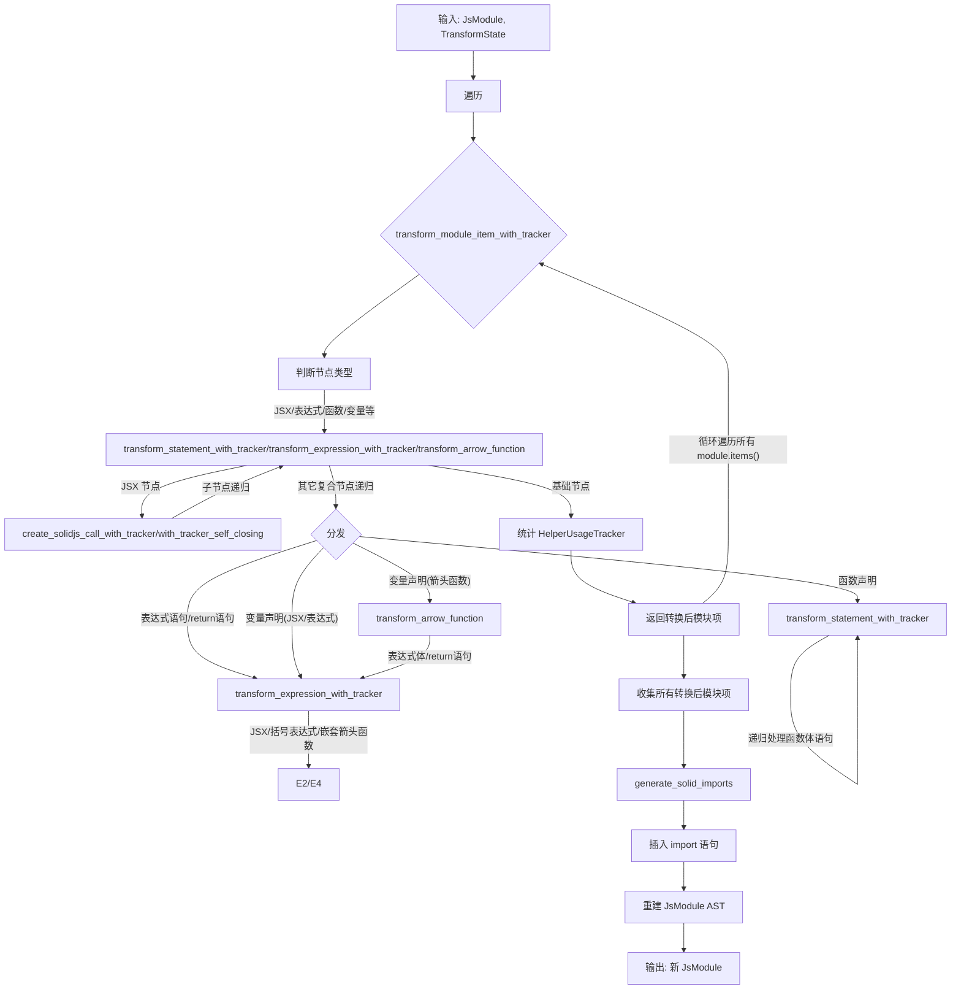

```mermaid
flowchart TD
    A[输入: JsModule, TransformState] --> B[遍历]
    B --> C{transform_module_item_with_tracker}
    C --> D[判断节点类型]
    D -- JSX/表达式/函数/变量等 --> E[transform_statement_with_tracker/transform_expression_with_tracker/transform_arrow_function]
    E -- JSX 节点 --> F[create_solidjs_call_with_tracker/with_tracker_self_closing]
    F -- 子节点递归 --> E
    E -- 其它复合节点递归 --> E1{分发}
    E1 -- 表达式语句/return语句 --> E2[transform_expression_with_tracker]
    E1 -- 函数声明 --> E3[transform_statement_with_tracker]
    E1 -- 变量声明(箭头函数) --> E4[transform_arrow_function]
    E1 -- 变量声明(JSX/表达式) --> E2
    E2 -- JSX/括号表达式/嵌套箭头函数 --> E2/E4
    E3 -- 递归处理函数体语句 --> E3
    E4 -- 表达式体/return语句 --> E2
    E -- 基础节点 --> G[统计 HelperUsageTracker]
    G --> H[返回转换后模块项]
    H -- 循环遍历所有 module.items() --> C
    H --> I[收集所有转换后模块项]
    I --> J[generate_solid_imports]
    J --> K[插入 import 语句]
    K --> L[重建 JsModule AST]
    L --> M[输出: 新 JsModule]

```
