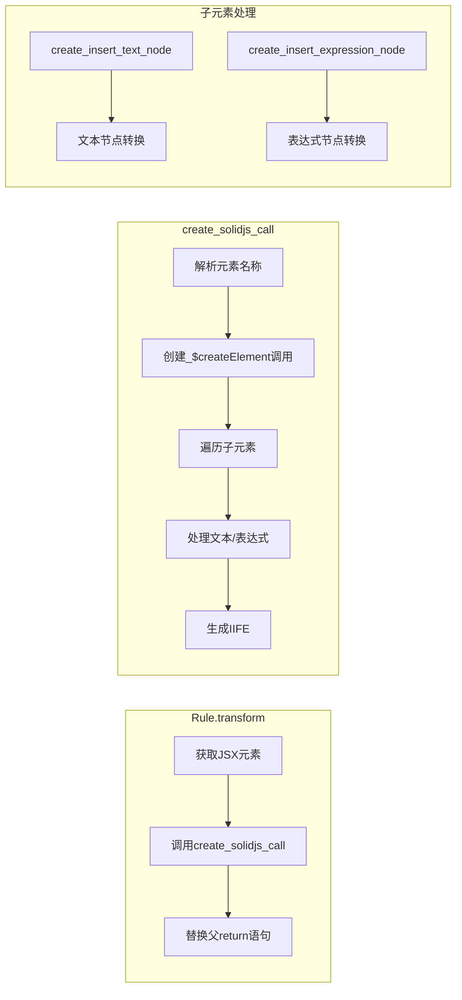
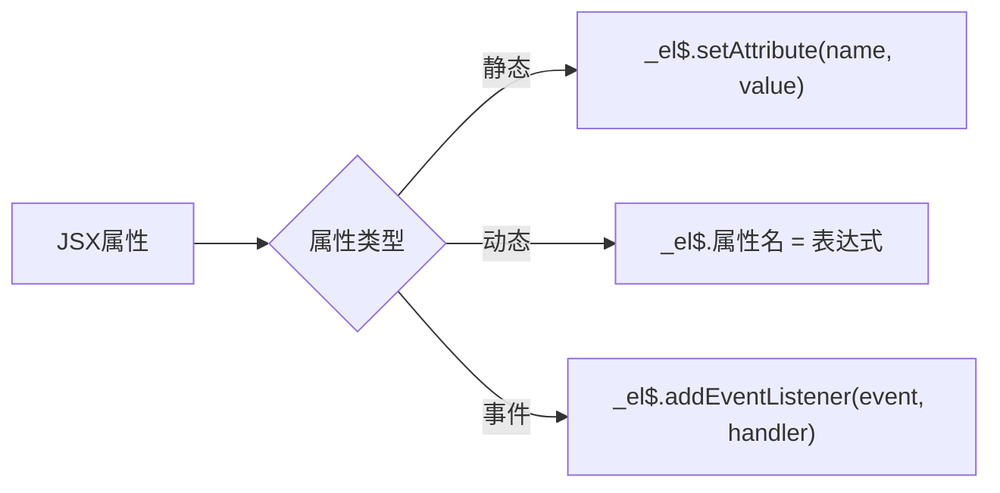

# SaplingJS Transformer Development TODO

## 当前状态 ✅

JSX Template 转换器的核心功能已实现：

### 已完成功能
- [x] JSX 元素解析与识别
- [x] 基础元素转换为 `_$createElement()` 调用
- [x] 文本节点处理 (`_$insertNode` + `_$createTextNode`)
- [x] 简单表达式子元素处理
- [x] IIFE (立即执行函数) 包装
- [x] 编译错误修复完成

## 转换流程图

```mermaid
graph TD
    A[JSX输入: &lt;button type=&quot;button&quot;&gt;{value}&lt;/button&gt;] --> B[解析JSX元素]
    B --> C[提取标签名]
    C --> D[创建变量声明: var _el$ = _$createElement&lpar;&quot;button&quot;&rpar;]
    D --> E[处理子元素]
    E --> F{子元素类型}
    F -->|文本节点| G[_$insertNode&lpar;_el$, _$createTextNode&lpar;text&rpar;&rpar;]
    F -->|表达式| H[_$insertNode&lpar;_el$, _$createTextNode&lpar;expression&rpar;&rpar;]
    F -->|其他| I[跳过处理]
    G --> J[创建return语句: return _el$]
    H --> J
    I --> J
    J --> K[包装为箭头函数]
    K --> L[创建IIFE: &lpar;&lpar;&rpar; => {...}&rpar;&lpar;&rpar;]
    L --> M[替换原JSX节点]
```

## 核心转换逻辑



## 下一步开发计划 🚀

### 1. 高优先级 (当前阶段)

#### 1.1 完善测试覆盖
- [ ] 运行现有测试并验证输出格式
- [ ] 添加更多测试用例：
  - [ ] 嵌套JSX元素
  - [ ] 带属性的元素
  - [ ] 复杂表达式
  - [ ] 组件引用

#### 1.2 属性处理
- [ ] 实现JSX属性转换
- [ ] 支持静态属性设置
- [ ] 支持动态属性绑定
- [ ] 事件处理器绑定



#### 1.3 导入语句生成
- [ ] 自动添加必要的导入语句
- [ ] 检测已存在的导入并避免重复

### 2. 中优先级

#### 2.1 支持更多JSX特性
- [ ] 自闭合标签处理
- [ ] Fragment 支持
- [ ] 条件渲染优化
- [ ] 列表渲染支持

#### 2.2 优化生成代码
- [ ] 减少不必要的函数调用
- [ ] 模板字符串优化
- [ ] 静态提升

### 3. 低优先级

#### 3.1 高级特性
- [ ] TypeScript 类型保持
- [ ] Source Map 支持
- [ ] 错误恢复机制

#### 3.2 性能优化
- [ ] 批量DOM操作
- [ ] 缓存优化
- [ ] 编译时优化

## 技术债务

- [ ] 清理未使用的导入语句
- [ ] 重构重复代码
- [ ] 添加错误处理
- [ ] 完善文档注释

## 当前限制

1. 只支持简单的标识符表达式
2. 暂不支持JSX属性
3. 暂不支持嵌套JSX元素
4. 暂不支持组件引用

## 期望输出格式示例

### 输入
```jsx
<button type="button">{value}</button>
```

### 当前输出
```javascript
(() => {
  var _el$ = _$createElement("button");
  _$insertNode(_el$, _$createTextNode(`value`));
  return _el$;
})()
```

### 目标输出 (完整版)
```javascript
import { createElement as _$createElement } from "solid-universal-module";
import { insertNode as _$insertNode } from "solid-universal-module";
import { createTextNode as _$createTextNode } from "solid-universal-module";

(() => {
  var _el$ = _$createElement("button");
  _el$.setAttribute("type", "button");
  _$insertNode(_el$, _$createTextNode(`${value}`));
  return _el$;
})()