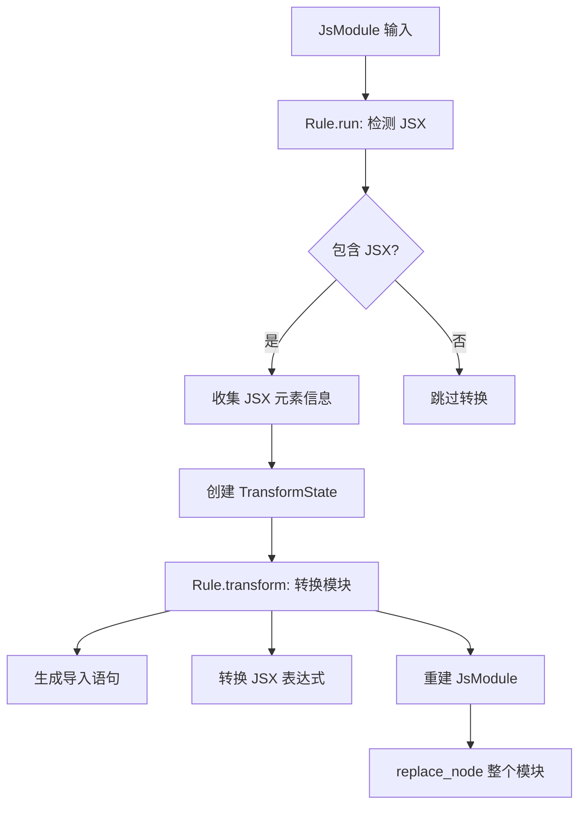

# SaplingJS Transformer Development TODO

## 当前状态 ✅ (更新)

### 已完成功能
- [x] JSX 元素解析与识别
- [x] 基础元素转换为 `_$createElement()` 调用
- [x] 文本节点处理 (`_$insertNode` + `_$createTextNode`)
- [x] 简单表达式子元素处理
- [x] IIFE (立即执行函数) 包装
- [x] 编译错误修复完成
- [x] **SolidJS Transform 框架架构** - 新增！
  - [x] 从 `JsModule` 根节点开始的转换逻辑
  - [x] `TransformState` 状态管理
  - [x] 模块级别的 JSX 检测和收集框架
  - [x] 整个模块替换的批量变更机制

## SolidJS Transform 架构



### 核心解决方案：根节点替换
对于你提出的"JsModule 是根节点，如何 replace"的问题，我们采用了以下方案：

```rust
// 在 transform 方法中
let mut mutation = module.clone().begin();
mutation.replace_node(module.clone(), new_module);
```

这样可以直接替换整个模块，因为 `BatchMutation` 机制允许根节点的替换。

---

## 下一步实现优先级

### 1. 高优先级 - 完善框架核心逻辑

#### 1.1 实现 JSX 检测逻辑
- [ ] 完善 `contains_jsx()` 函数
  - [ ] 递归遍历 AST 查找 `JsxTagExpression` 
  - [ ] 支持函数内、表达式内的 JSX 检测

#### 1.2 实现 JSX 收集逻辑
- [ ] 完善 `collect_jsx_elements()` 函数
  - [ ] 收集 JSX 元素的位置信息
  - [ ] 记录 JSX 的上下文信息（函数内、return 语句等）

#### 1.3 实现模块转换逻辑
- [ ] 完善 `transform_module()` 函数
  - [ ] 生成必要的导入语句
  - [ ] 转换包含 JSX 的语句/表达式
  - [ ] 重新构建完整的 `JsModule`

### 2. 中优先级 - 属性和高级特性

#### 2.1 属性处理实现
- [ ] 完善 `handle_jsx_attributes()` 函数
- [ ] 支持静态属性、动态属性、事件处理

#### 2.2 导入语句生成
- [ ] 完善 `generate_solid_imports()` 函数
- [ ] 自动检测需要的运行时函数并生成对应导入

### 3. 低优先级 - 测试和优化

#### 3.1 测试覆盖
- [ ] 添加模块级别的转换测试
- [ ] 验证根节点替换的正确性

---

## 技术要点记录

### 关键设计决策
1. **Query 类型**: 从 `Ast<JsxTagExpression>` 改为 `Ast<JsModule>`，实现整个模块的转换
2. **State 管理**: 使用 `TransformState` 收集和传递转换所需的信息
3. **根节点替换**: 通过 `BatchMutation` 直接替换整个模块，解决根节点无父节点的问题

### 当前框架状态
- ✅ 编译通过，无语法错误
- ✅ 类型系统兼容
- ⚠️ 核心逻辑函数需要实现（标记为 TODO）

### 推荐下一步
优先实现 `contains_jsx()` 函数，这是整个转换流程的入口点。可以先实现一个简单版本来验证框架的可行性。